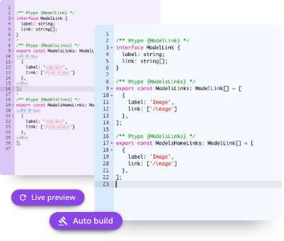
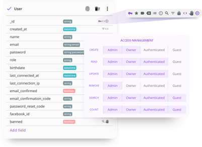
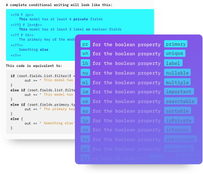

- [Howdy, developer!](https://github.com/hapify/hapify#howdy-developer)
- [Good reasons to check out Hapify](https://github.com/hapify/hapify#5-reasons-to-check-out-hapify)
- [Get Started](https://github.com/hapify/hapify#get-started)
- [Community](https://github.com/hapify/hapify#community)
- [Getting Help](https://github.com/hapify/hapify#getting-help)
- [Architecture](https://github.com/hapify/hapify/blob/master/README.md#architecture)

## Howdy, developer!

Hapify was born out of the desire to **accelerate modern development**, by replacing traditional statics boilerplates with **dynamic boilerplates**. Hapify removes the need to write repeating boilerplate for extended CRUD operations for both backend & frontend development. Focus on features instead of doing repetitive work !

- Hapify is an agnostic code engine & tools allowing the creation of any kind of API based app, in any language
- Hapify takes two inputs, the relational data-models and code templates.
- Hapify does not command any paradigm or code structure. You can write your own code templates or use the ones provided by the community.

| 1. Dynamic Templating | 2. Data modeling | 3. Code Engine |
| --- | --- | --- |
|  |  |  |

## 5 reasons to check out Hapify

1. We've improved boilerplates.
2. Our open source [templating syntax](https://docs.hapify.io/en/latest/templating/hapify/syntax/) is unique, simple and powerful.
3. Your are free to [write you own dynamic boilerplates](https://docs.hapify.io/en/latest/cli/#create-a-new-boilerplate-channel) with you own specifications, in any language
4. You can easily reverse-engineer your current static boilerplates
5. We strongly encourage our community to share boilerplates and data-models collections on [Hapify Hub](https://hub.hapify.io/).

## Get Started

Visit our [Get Started Tutorial](https://www.hapify.io/get-started)

## Community

### Resources
You can browse and import sample boilerplates & data models in your Hapify projects thanks to The [Hapify Community Hub](https://hub.hapify.io/).

### Contributing

Contributions are **welcome and extremely helpful** 🙌
- [File a detailed bug report](https://github.com/hapify/hapify/issues/new?template=bug_report.md)
- [Plan out a new feature](https://github.com/hapify/hapify/issues/new?template=feature_request.md)
- [Povide Documentation Feedback](https://github.com/hapify/hapify/issues/new??template=documentation.md)

Please refer [to the contribution guide](https://github.com/hapify/hapify/blob/master/CONTRIBUTING.md) for more information.

### Channels
- [Slack](https://hapify.slack.com)
- [Email](mailto:hello@hapify.io)

## Getting Help
- [Official documentation](https://docs.hapify.io/)
- [Official website](https://www.hapify.io)

